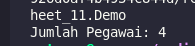
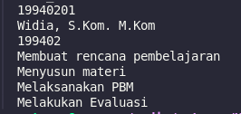
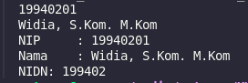
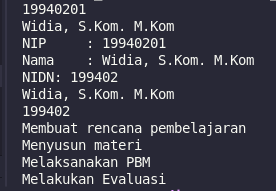
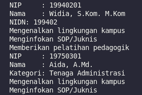

# Laporan Praktikum OOP Jobsheet 10 - Polymorphism

## Nama Kelompok:
- **ALYSSA TIFARA YUWONO** (2341760164)
- **DIPA PRAJA PRAMONO** (2341760143)
- **IGA RAMADANA SAHPUTRA** (2341760083)
- **MALIK ADZANO ARYASATYA DHARMAPUTERA** (2341760161)
- **NOVA DIANA RAMADHAN** (2341760104)

---

## Kode Program dari Jobsheet 10 - Polymorphism

### Heterogenous Collection
### Class `Pegawai`

```java
package Jobsheet_11;

public class Pegawai {
	public String nama;
	public String nip;

    public Pegawai(){
    }

	public Pegawai(String nip, String nama) {
		this.nama = nama;
		this.nip = nip;
	}

    public void displayInfo() {
        System.out.println("NIP     : " + nip);
        System.out.println("Nama    : " + nama);
    }
}

```

### Class `Dosen`

```java
package Jobsheet_11;

public class Dosen extends Pegawai {
	public String nidn;

	public Dosen() {
	}

	public Dosen(String nip, String nama, String nidn) {
		super(nip, nama);
		this.nidn = nidn;
	}

	public void displayInfo() {
		super.displayInfo();
		System.out.println("NIDN: " + nidn);
	}

	public void mengajar() {
		System.out.println("Membuat rencana pembelajaran");
		System.out.println("Menyusun materi");
		System.out.println("Melaksanakan PBM");
		System.out.println("Melakukan Evaluasi");
	}
}
```

### Class `TenagaKependidikan`

```java
package Jobsheet_11;

public class TenagaKependidikan extends Pegawai {
	public String kategori;

	public TenagaKependidikan() {

	}

	public TenagaKependidikan(String nip, String nama, String kategori) {
		super(nip, nama);
		this.kategori = kategori;
	}

	public void displayInfo() {
		super.displayInfo();
		System.out.println("Kategori: " + kategori);
	}
}
```

### Class `Demo`
```java
package Jobsheet_11;

import java.util.ArrayList;

public class Demo {
    public static void main(String[] args) {
        Dosen dosen1 = new Dosen("19940201", "Widia, S.Kom. M.Kom", "199402");
        Dosen dosen2 = new Dosen("19700105", "Muhammad, S.T, M.T", "197001");
        TenagaKependidikan tendik1 = new TenagaKependidikan("19750301", "Aida, A.Md.", "Tenaga Administrasi");
        TenagaKependidikan tendik2 = new TenagaKependidikan("19650304", "Rika, S.T.", "Tenaga Laboratorium");

        ArrayList<Pegawai> daftarPegawai = new ArrayList<Pegawai>();

        daftarPegawai.add(dosen1);
        daftarPegawai.add(dosen2);
        daftarPegawai.add(tendik1);
        daftarPegawai.add(tendik2);

        System.out.println("Jumlah Pegawai: " + daftarPegawai.size());
    }
}
```

### Berikut adalah Hasil Run dari Program diatas


### Object Casting
### Class `Pegawai`

```java
package Jobsheet_11;

public class Pegawai {
	public String nama;
	public String nip;

    public Pegawai(){
    }

	public Pegawai(String nip, String nama) {
		this.nama = nama;
		this.nip = nip;
	}

    public void displayInfo() {
        System.out.println("NIP     : " + nip);
        System.out.println("Nama    : " + nama);
    }
}

```

### Class `Dosen`

```java
package Jobsheet_11;

public class Dosen extends Pegawai {
	public String nidn;

	public Dosen() {
	}

	public Dosen(String nip, String nama, String nidn) {
		super(nip, nama);
		this.nidn = nidn;
	}

	public void displayInfo() {
		super.displayInfo();
		System.out.println("NIDN: " + nidn);
	}

	public void mengajar() {
		System.out.println("Membuat rencana pembelajaran");
		System.out.println("Menyusun materi");
		System.out.println("Melaksanakan PBM");
		System.out.println("Melakukan Evaluasi");
	}
}
```

### Class `TenagaKependidikan`

```java
package Jobsheet_11;

public class TenagaKependidikan extends Pegawai {
	public String kategori;

	public TenagaKependidikan() {

	}

	public TenagaKependidikan(String nip, String nama, String kategori) {
		super(nip, nama);
		this.kategori = kategori;
	}

	public void displayInfo() {
		super.displayInfo();
		System.out.println("Kategori: " + kategori);
	}
}
```
### Class `Demo`
```java
package Jobsheet_11;

import java.util.ArrayList;

public class Demo {
    public static void main(String[] args) {
        Dosen dosen1 = new Dosen("19940201", "Widia, S.Kom. M.Kom", "199402");
        
        System.out.println(dosen1.nip);
        System.out.println(dosen1.nama);
        System.out.println(dosen.nidn);
        dosen1.mengajar();
    }
}
```

### Berikut adalah Hasil Run dari Program diatas


### Modifikasi untuk Upcasting
```java
Dosen dosen1 = new Dosen("19940201", "Widia, S.Kom. M.Kom", "199402");

        Pegawai pegawai1 = dosen1;
        
        System.out.println(dosen1.nip);
        System.out.println(dosen1.nama);
        pegawai1.displayInfo();
```
### Berikut adalah hasil Run dari modifikasi


### Modifikasi untuk Downcasting
```java
public static void main(String[] args) {
        Dosen dosen1 = new Dosen("19940201", "Widia, S.Kom. M.Kom", "199402");

        Pegawai pegawai1 = dosen1;
        
        System.out.println(dosen1.nip);
        System.out.println(dosen1.nama);
        pegawai1.displayInfo();

        Dosen newDosen = (Dosen) pegawai1;

        System.out.println(newDosen.nama);
        System.out.println(newDosen.nidn);
        newDosen.mengajar();
    }
```
### Berikut adalah hasil Run dari modifikasi Downcasting


### Modifikasi Program dengan konsep Polimorfisme
```java
public class Demo {
    public static void main(String[] args) {
        Dosen dosen1 = new Dosen("19940201", "Widia, S.Kom. M.Kom", "199402");
        TenagaKependidikan tendik1 = new TenagaKependidikan("19750301", "Aida, A.Md.", "Tenaga Administrasi");

        train(dosen1);
        train(tendik1);
    }

    public static void train(Pegawai pegawai) {
        pegawai.displayInfo();
        System.out.println("Mengenalkan lingkungan kampus");
        System.out.println("Menginfokan SOP/Juknis");

        if (pegawai instanceof Dosen) {
            System.out.println("Memberikan pelatihan pedagogik");
        }
    }
}
```
### Berikut adalah output dari modifikasi dengan konsep Polimorfisme


### Pertanyaan
1. Apakah upcasting dapat dilakukan dari suatu class terhadap class lain yang tidak memiliki relasi inheritance?
2. Dari 2 baris kode program berikut, manakan proses upcasting yang tepat? Jelaskan
```java
Pegawai pegawai1 = new Dosen();
Pegawai pegawai1 = (Pegawai) new Dosen();
```
3. Apa fungsi dari keyword instanceOf?
4. Apa yang dimaksud heterogenous collection?
5. Sebuah object diinstansiasi dari class Pegawai. Kemudian dilakukan downcasting menjadi
object bertipe Dosen. Apakah hal ini dapat dilakukan? Lakukan percobaan untuk
membuktikannya. 

### Jawaban
1.  Tidak, upcasting hanya dapat dilakukan jika kedua class memiliki relasi inheritance. Artinya, satu class harus menjadi subclass dari class lain. Jika tidak ada relasi inheritance, upcasting tidak dapat dilakukan.
2. Kedua baris kode tersebut melakukan upcasting dengan cara yang benar. Dalam Java, keduanya adalah cara yang valid untuk melakukan upcasting dari Dosen ke Pegawai. Upcasting secara implisit terjadi pada baris pertama dan secara eksplisit pada baris kedua, tetapi keduanya menghasilkan hasil yang sama.
3. Keyword instanceof digunakan untuk memeriksa apakah suatu object adalah instance dari suatu class atau subclass tertentu. Ini berguna untuk verifikasi tipe sebelum melakukan downcasting atau saat ingin memastikan jenis object yang sedang dihadapi.
4. Heterogeneous collection adalah koleksi yang dapat menyimpan berbagai tipe object yang berbeda dalam satu wadah. Misalnya, sebuah ArrayList di Java bisa menyimpan object dari tipe String, Integer, dan Pegawai sekaligus.
5. Ya, hal ini dapat dilakukan jika object asli adalah instance dari class Dosen. Jika tidak, akan terjadi ClassCastException. Berikut adalah contoh kode untuk melakukan downcasting:
```java
Pegawai pegawai = new Dosen(); // Instansiasi object dari class Dosen
if (pegawai instanceof Dosen) {
    Dosen dosen = (Dosen) pegawai; // Downcasting ke tipe Dosen
    System.out.println("Downcasting berhasil.");
} else {
    System.out.println("Downcasting gagal.");
}
```