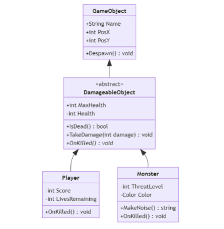
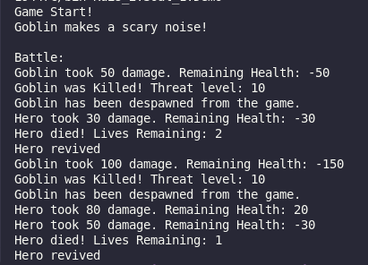
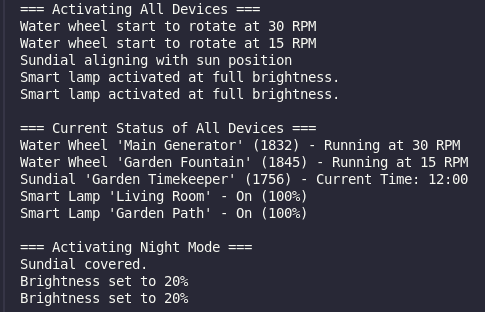
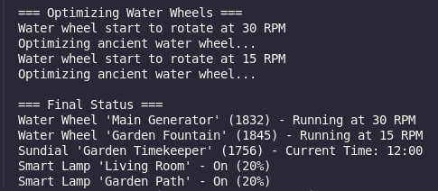

# Laporan Praktikum Kuis 2 OOP

#### Nama   : **IGA RAMADANA SAHPUTRA**
#### NIM    : **2341760083**
#### Kelas  : **SIB-2C/16**

---

## Soal 1
Identifikasi penggunaan Abstract method dan Class berikut, jelaskan
maksud dari class diagramnya dan buatlah kode programnya hingga pada
demo untuk menampilkannya.



## jawaban Soal 1
### Penjelasan Class Diagram

Diagram ini mendemonstrasikan penggunaan **Abstract Class** dan **Abstract Method** dalam sebuah hierarki objek permainan.

### 1. GameObject
**GameObject** adalah kelas dasar yang menjadi parent dari semua objek dalam diagram ini.

### Atribut:
- `Name` (String): Nama dari objek.
- `PosX` (int): Posisi X objek pada koordinat.
- `PosY` (int): Posisi Y objek pada koordinat.

### Method:
- `Despawn()`: Menghapus objek dari permainan.

---

### 2. DamageableObject
**DamageableObject** adalah **Abstract Class** yang memperluas **GameObject**. Kelas ini digunakan untuk objek yang dapat menerima kerusakan (*damage*).

### Atribut:
- `MaxHealth` (int): Kesehatan maksimum dari objek.
- `Health` (int): Kesehatan saat ini dari objek.

### Method:
- `IsDead()` (boolean): Mengembalikan nilai `true` jika objek mati.
- `TakeDamage(int damage)`: Mengurangi kesehatan objek sesuai nilai `damage`.
- `OnKilled()` (abstract): Method abstrak yang harus diimplementasikan oleh turunan untuk menangani logika saat objek mati.

---

### 3. Player
**Player** adalah turunan dari **DamageableObject** yang merepresentasikan karakter pemain dalam permainan.

### Atribut:
- `Score` (int): Skor yang diperoleh oleh pemain.
- `LivesRemaining` (int): Jumlah nyawa yang tersisa.

### Method:
- `OnKilled()`: Mengimplementasikan logika saat pemain mati. Jika nyawa masih ada, pemain respawn dengan kesehatan penuh.

---

### 4. Monster
**Monster** adalah turunan dari **DamageableObject** yang merepresentasikan musuh dalam permainan.

### Atribut:
- `ThreatLevel` (int): Tingkat ancaman monster.
- `Color` (String): Warna dari monster.

### Method:
- `MakeNoise()` (String): Menghasilkan suara dari monster.
- `OnKilled()`: Mengimplementasikan logika saat monster mati. Monster akan menghilang dari permainan.

---

## Berikut adalah implementasi dari kode program Soal 1
## Class `GameObject`
```java
package Kuis_2.Soal_1;

public class GameObject {
    public String name;
    public int posx, posy;

    public GameObject(String name, int posx, int posy) {
        this.name = name;
        this.posx = posx;
        this.posy = posy;
    }

    public void despawn() {
        System.out.println(name + " has been despawned from the game.");
    }
}
```
## Class `DamageableObject`
```java
package Kuis_2.Soal_1;

public abstract class DamagableObject extends GameObject {
    public int maxhealth;
    protected int health;

    public DamagableObject(String name, int posx, int posy, int maxhealth) {
        super(name, posx, posy);
        this.maxhealth = maxhealth;
        this.health = health;
    }

    public boolean isDead() {
        return health <= 0;
    }

    public void takeDamage(int damage) {
        health -= damage;
        System.out.println(name + " took " + damage + " damage. Remaining Health: " + health);
        if (isDead()) {
            onKilled();
        }
    }

    public abstract void onKilled();
}
```
## Class `Player`
```java
package Kuis_2.Soal_1;

public abstract class DamagableObject extends GameObject {
    public int maxhealth;
    protected int health;

    public DamagableObject(String name, int posx, int posy, int maxhealth) {
        super(name, posx, posy);
        this.maxhealth = maxhealth;
        this.health = health;
    }

    public boolean isDead() {
        return health <= 0;
    }

    public void takeDamage(int damage) {
        health -= damage;
        System.out.println(name + " took " + damage + " damage. Remaining Health: " + health);
        if (isDead()) {
            onKilled();
        }
    }

    public abstract void onKilled();
}
```
## Class `Monster`
```java
package Kuis_2.Soal_1;

public class Monster extends DamagableObject {
    private int threatLevel;
    private String color;

    public Monster(String name, int posx, int posy, int maxhealth, int threatLevel, String color) {
        super(name, posx, posy, maxhealth);
        this.threatLevel = threatLevel;
        this.color = color;
    }

    @Override
    public void onKilled() {
        System.out.println(name + " was Killed! Threat level: " + threatLevel);
        despawn();
    }

    public void makeNoise() {
        System.out.println(name + " makes a scary noise!");
    }
}
```
## Class `Demo`
```java
package Kuis_2.Soal_1;

public class Demo {
    public static void main(String[] args) {
        Player player = new Player("Hero", 0, 0, 100, 3);
        Monster monster = new Monster("Goblin", 10, 5, 150, 10, "Red");

        System.out.println("Game Start!");
        monster.makeNoise();

        System.out.println("\nBattle:");
        monster.takeDamage(50);
        player.takeDamage(30);

        monster.takeDamage(100);
        player.takeDamage(80);
        player.takeDamage(50);
    }
}
```
## Berikut adalah hasil Run dari Program Soal 1


## Soal 2
Seorang client Anda seorang Seller yang memiliki banyak media untuk
menampung Order dari customer, Namun Seller ini kesulitan dalam
membuat kategori Order, dia ingin setiap order wajib ada tanggal order
dan wajib ada method konfirmasi setiap kategori yang dipisah menjadi 3
class: MailOrder, WebOrder, WhatsappOrder. Terdapat kontrak
“pelacakan status order” pada pada class MailOrder dan WebOrder
Bantu client Anda dengan menggambarkan class diagramnya yang mudah
dia pahami!

## Jawaban Soal 2

### Berikut adalah Penjelasannya
#### 1. Class `Order` sebagai abstract class yang memiliki:
- Property `orderDate` yang wajib ada di setiap order
- Method abstract `confirmedorder()` yang wajib diimplementasikan di setiap child class
- Method `getOrderStatus()` untuk mendapatkan status order
#### 2. Interface `OrderTrackable` yang berisi:
- Method `trackOrder()` yang wajib diimplementasi oleh class yang membutuhkan fitur pelacakan
#### 3. Class `MailOrder` yang:
- Mewarisi dari class `Order`
- Mengimplementasi interface `OrderTrackable`
- Memiliki property khusus untuk order via mail
- Mengimplementasi semua method yang diperlukan
#### 4. Class `WebOrder` yang:
- Mewarisi dari class `Order`
- Mengimplementasi interface `OrderTrackable`
- Memiliki property khusus untuk order via website
- Mengimplementasi semua method yang diperlukan
#### 5. Class `WhatsappOrder` yang:
- Mewarisi dari class `Order`
- Memiliki property khusus untuk order via Whatsapp
- Mengimplementasi method dari class Order
- Tidak mengimplementasi `OrderTrackable` karena tidak memerlukan fitur pelacakan

---

## Soal 3
Berilah contoh kode program penggunaan konsep polymorphism
(Heterogenous Collection, Object Casting, Polymorphic Arguments, 
InstanceOf) pada 1 tema(misalkan pilih 1 tema: kendaraan atau alat
elektronik atau animal dst… Anda bisa membuat tema apa saja untuk
menerapkan 4 point konsep polymorphism). Buatlah kode program java
yang saling berkaitan.

## Jawaban Soal 3
### Tema: Ancient Smart Home (Perangkat Pintar Rumah Kuno).
### Berikut adalah kode program Java yang menerapkan konsep polymorphism:
#### Class `Device`
```java
package Kuis_2.Soal_3;

public interface Device {
    public void activate();
    public void deactivate();
    public String getStatus();
}
```
#### Class `AncientMechanisme`
```java
package Kuis_2.Soal_3;

public abstract class AncientMechanisme implements Device {
    protected String name;
    protected boolean isActive;
    protected int yearMade;

    public AncientMechanisme(String name, int yearMade) {
        this.name = name;
        this.yearMade = yearMade;
        this.isActive = false;
    }

    @Override
    public void activate() {
        isActive = true;
        initiateMechanisme();
    }

    protected abstract void initiateMechanisme();
}
```

#### Class `WaterWheel`
```java
package Kuis_2.Soal_3;

public class WaterWheel extends AncientMechanisme{
    private int rotationSpeed;

    public WaterWheel(String name, int yearMade, int rotationSpeed) {
        super(name, yearMade);
        this.rotationSpeed = rotationSpeed;
    }

    @Override
    protected void initiateMechanisme() {
        System.out.println("Water wheel start to rotate at " + rotationSpeed + " RPM");
    }

    @Override
    public void deactivate() {
        System.out.println("Water wheel is stopped.");
        isActive = false;
    }

    @Override
    public String getStatus() {
        return "Water Wheel '" + name + "' (" + yearMade + ") - " + 
               (isActive ? "Running at " + rotationSpeed + " RPM" : "Stopped");
    }
}
```

#### Class `SundialClock`
```java
package Kuis_2.Soal_3;

public class SundialClock extends AncientMechanisme {
    private String currentTime;

    public SundialClock(String name, int yearMade) {
        super(name, yearMade);
        this.currentTime = "Unknown";
    }

    @Override
    protected void initiateMechanisme() {
        System.out.println("Sundial aligning with sun position");
        calculateTime();
    }

    private void calculateTime() {
        this.currentTime = "12:00";
    }

    @Override
    public String getStatus() {
        return "Sundial '" + name + "' (" + yearMade + ") - Current Time: " + currentTime;
    }

    @Override
    public void deactivate() {
        System.out.println("Sundial covered.");
        isActive = false;
    }
}
```
#### Class `SmartLamp`
```java
package Kuis_2.Soal_3;

public class SmartLamp implements Device {
    private String name;
    private boolean isOn;
    private int brightness;

    public SmartLamp(String name) {
        this.name = name;
        this.isOn = false;
        this.brightness = 0;
    }

    @Override
    public void activate() {
        isOn = true;
        brightness = 100;
        System.out.println("Smart lamp activated at full brightness.");
    }

    @Override
    public void deactivate() {
        isOn = false;
        brightness = 0;
        System.out.println("Smart lamp turned off");
    }

    @Override
    public String getStatus() {
        return "Smart Lamp '" + name + "' - " + (isOn ? "On (" + brightness + "%)" : "Off");
    }

    public void setBrightness(int brightness) {
        this.brightness = brightness;
        System.out.println("Brightness set to " + brightness + "%");
    }
}
```
#### Class `AncientSmartHomeController`
```java
package Kuis_2.Soal_3;

import java.util.ArrayList;
import java.util.List;

public class AncientSmartHomeController {
    private List<Device> devices;

    public AncientSmartHomeController() {
        this.devices = new ArrayList<>();
    }

    public void addDevice(Device device) {
        devices.add(device);
    }

    public void optimizeWaterWheels() {
        for (Device device : devices) {
            if (device instanceof WaterWheel) {
                WaterWheel wheel = (WaterWheel) device;
                wheel.activate();
                System.out.println("Optimizing ancient water wheel...");
            }
        }
    }

    public void activateAllDevices() {
        for (Device device : devices) {
            device.activate();
        }
    }

    public void deactivateAllDevices() {
        for (Device device : devices) {
            device.deactivate();
        }
    }

    public void showAllStatuses() {
        for (Device device : devices) {
            System.out.println(device.getStatus());
        }
    }

    public void nightMode() {
        for (Device device : devices) {
            if (device instanceof SmartLamp) {
                SmartLamp lamp = (SmartLamp) device;
                lamp.setBrightness(20);
            } else if (device instanceof SundialClock) {
                device.deactivate();
            }
        }
    }
}
```
#### Class `AncientSmartHomeDemo`
```java
package Kuis_2.Soal_3;

public class AncientSmartHomeDemo {
    public static void main(String[] args) {
        AncientSmartHomeController controller = new AncientSmartHomeController();

        // Membuat berbagai perangkat
        WaterWheel wheel1 = new WaterWheel("Main Generator", 1832, 30);
        WaterWheel wheel2 = new WaterWheel("Garden Fountain", 1845, 15);
        SundialClock sundial = new SundialClock("Garden Timekeeper", 1756);
        SmartLamp lamp1 = new SmartLamp("Living Room");
        SmartLamp lamp2 = new SmartLamp("Garden Path");

        // Menambahkan perangkat ke controller (Polymorphic Arguments)
        controller.addDevice(wheel1);
        controller.addDevice(wheel2);
        controller.addDevice(sundial);
        controller.addDevice(lamp1);
        controller.addDevice(lamp2);

        System.out.println("=== Activating All Devices ===");
        controller.activateAllDevices();

        System.out.println("\n=== Current Status of All Devices ===");
        controller.showAllStatuses();

        System.out.println("\n=== Activating Night Mode ===");
        controller.nightMode();

        System.out.println("\n=== Optimizing Water Wheels ===");
        controller.optimizeWaterWheels();

        System.out.println("\n=== Final Status ===");
        controller.showAllStatuses();
    }
}
```
### Berikut adalah hasil run dari program `Ancient Smart Home`



### Berikut adalah penjelasan dari program di atas:
#### 1. Heterogeneous Collection:
- Implementasi pada `AncientSmartHomeController` dengan `List<Device>` yang dapat menyimpan berbagai jenis perangkat (WaterWheel, SundialClock, SmartLamp).
- Semua objek berbeda dapat disimpan dalam satu collection karena mengimplementasi interface `Device`.
#### 2. Object Casting:
- Digunakan dalam method `optimizeWaterWheels()` dan `nightMode()`.
- Casting dari Device ke `WaterWheel` dan `SmartLamp` untuk mengakses method spesifik.
#### 3. Polymorphic Arguments:
- Method `addDevice()` menerima parameter bertipe `Device`.
- Dapat menerima semua objek yang mengimplementasi interface `Device`.
#### 4. InstanceOf:
- Digunakan dalam `optimizeWaterWheels()` dan `nightMode()`
- Memeriksa tipe spesifik device untuk penanganan khusus.